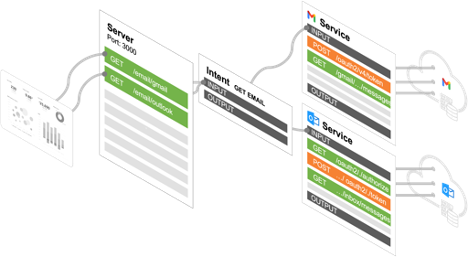

# Intent (Service Abstraction)

## What is Intent?

Intent helps the server by standardizing the INPUT and OUTPUT of common services.  

For example, getting an email is a common intent for all email services. 

Instead of the server calling the email services with different inputs and outputs, the services can adopt the intent’s input and output to standardize the call for the servers.



## Configuring the Intent

### Create a new Intent


Create an ID for the Intent.


### Define the input and output

&lt;aside&gt;
💡 Behind the scene, [JSON Schema](../https://json-schema.org/understanding-json-schema/) used to perform the input and output validation

&lt;/aside&gt;


Create Input and Output arguments


&lt;aside&gt;
💡 Arguments are the keys for the [JSON Schema](../https://json-schema.org/understanding-json-schema/) properties
For example, for the below JSON, username and password are the arguments

```json
    "username_intent": { "type": "string" },
    "password_intent": { "type": "string" },
```

&lt;/aside&gt;

## How to use an Intent

Go to the Server page

### Add an Intent to the Service operation


Select the intent to use


### Map the Service input and output with Intent


## Applying actions between mapping

### Method 1:  Select **Execution Action** from the **Data Element** popup

This is used to directly apply the action between the mapping


Select an action


Apply the action


### Method 2:  Click on the Action button

This is used to create an action that can be used during the mapping.

For example, making a database query and making the data available for use during the mapping.

Store the value in the **variable** scope for use


## Using Intent from the Server

When [selecting the Service operation](../Service) from the Server, you now have to option to use the intent with the service.


## Versioning the Service

You can version the Service for easier rollback and management.

### Add new version

Press the Add Version to create a new version

