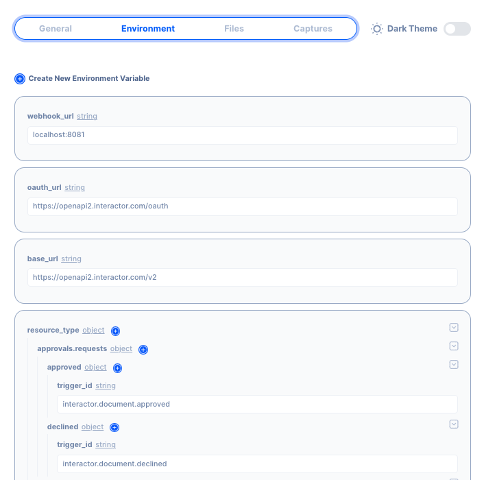

# Scopes and Variables

A scope refers to the portion of a configuration where a particular variable, function, or other named entity is visible or accessible. It determines the area of the configuration where a variable can be referenced, modified, or used. Scope helps in organizing and controlling the visibility and lifetime of variables, preventing naming conflicts, and facilitating modular programming.

There are several types of scope:

1. Environmental (Global) scope
2. Operation (Function) scope
3. Action (Local) scope

## Environmental (Global) scope

Variables defined in environmental variable are accessible from any part of the product. They have the broadest visibility and can be accessed throughout the product

### Defining a environmental variable

Environmental Variable can be defined in the Setting section.  Navigate to the `Environment` tab.  The variable can use any Value Type Selector.

### Accessing the Environmental Variable

Environment variable can be access from the Value Type Selector.

## Operation (Function) scope

Operation scopes are visible and accessible only within that operation and its nested blocks.

### Defining a operation variable

- **Simulation**:  Use the data simulation to define the initial data set (refer to simulation page for more details
- **Action’s OUTPUT**:  Each action can output data after execution.

**Default Scope**

A scope called `variables`is provided for the developers to store data.

### Accessing the Operation Variable

Operation variable can be access from the Value Type Selector.

## Action (Local) scope

Action scope refers to the portion of data within a specific block, such as an iteration or conditional statement. Variables defined in an action scope are only accessible within that particular block or its nested blocks. Once the block is exited, the local variables typically cease to exist.

### Defining an Action Variable

In an iteration action, you can define a scope that will only exist within the action. In the example below, a scope call `interation-map-1` is created to store data during the loop.  

&gt; The iteration/map scope will contain the array’s indexes and values.
&gt; 

### Accessing the Action Variable

Add an action in the **Do This** section of the iteration.  In the *value*, select *data reference* from the Value Type Selector.

Below in the data reference, you can select the value from the action scope `iteration-map-1` .

