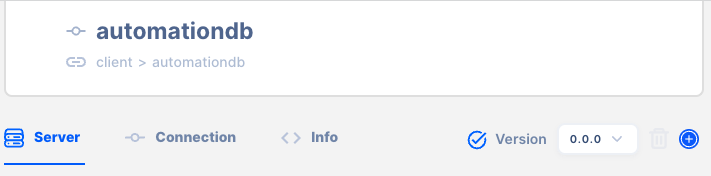

# Versioning

API AutoFlow provides versioning for each of the following sections:

- Server versioning
- API versioning
- Service versioning
- Client versioning
- Intent versioning

## Where to find the version

Version is located at the top of each section’s page.

## How to create a new version

Click the + button next to the version number.

Create a new version number.

You can duplicate the content from an existing version.

## How to delete a version

Click the trash button next to the version number

A confirmation popup will appear before deleting.

## Currently running version

&gt; **IMPORTANT**:  The version that you are working on may be different to the currently running version.
&gt; 

Currently running version is denoted with a check mark.

When the check mark is BLUE, you are working on the currently running version of the configuration

When a version that’s not currently running is selected, the check turns GREY.