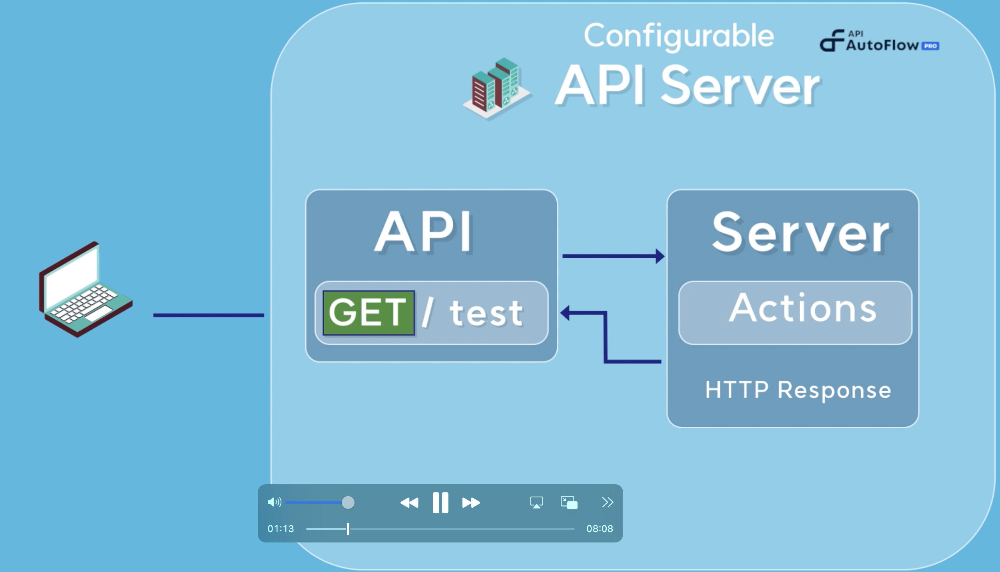
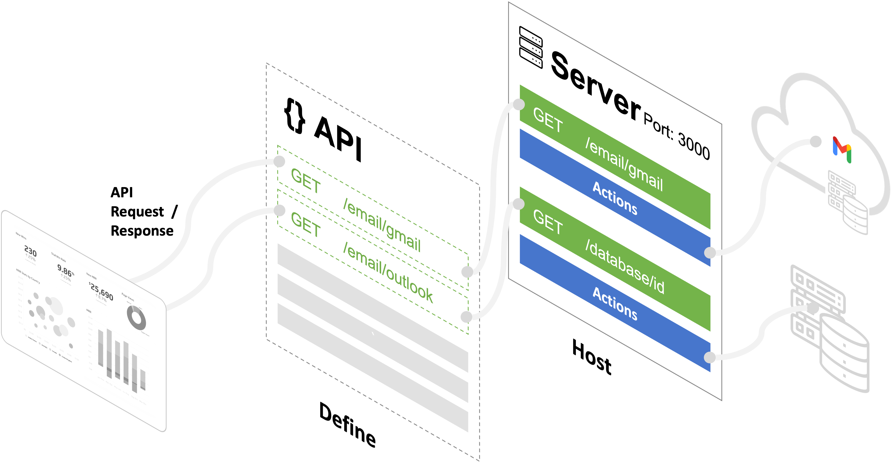

# Key Concepts

## Video Tutorial

Topics covered

- Define the APIs
- Create servers to host the APIs
- All other features in the product are to support the server

Duration:  3 mins

&lt;aside&gt;
💡 If there’s only one thing that you need to remember, 
**it’s how to create and configure the Server.**

&lt;/aside&gt;

### Everything in API AutoFlow evolves around the Server.

## Server

A server hosts the API and performs set of operations.  A server has a port number and set of security rules before it performs set of workflows for the application.  A server can utilize all the features in the product including database, files, clients, and more

Everything else in the product are there to support the Server.

## Libraries

Let’s look at each feature and how they relate to the server.

### 1. API

The API defines how API AutoFlow receives and responds to API requests. For instance, you can create a path `/test`, and set it to only receive GET requests. API AutoFlow uses an OpenAPI specification, formerly known as Swagger. This makes it easy for API professionals to quickly define the APIs and share the API documentation with others without needing to do additional work.

### 2. Services

A service helps the server by taking out commonly used actions into a reusable group.

A service an INPUT and an OUTPUT similar to functions in a programming language.

As service performs a set of operations with actions in it.

For example, a service to get an email from a GMAIL API can be reused by many servers.

### 3. Intents

**Intent** helps the server by standardizing the INPUT and OUTPUT of common services.  

For example, getting an email is a common intent for all email services. 

Instead of the server calling the email services with different inputs and outputs, the services can adopt the intent’s input and output to standardize the call for the servers.

### 4. Connections

**Connections** are connectors to a database and other systems.  For example, API AutoFlow provides a connector to popular databases such as Maria DB, MS SQL, Oracle, and more.

By configuring the connection with the database credentials and the server information, you can issue any SQL commands to work directly with the database.

### 5. Templates