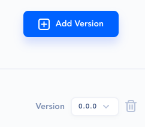

# Clients

## What is a Client?

**Clients** are connectors to the database and other systems.  For example, API AutoFlow provides a connector to popular databases such as Maria DB, MS SQL, Oracle, and more.

By configuring the connection with the database credentials and the server information, you can issue any SQL commands to work directly with the database.

## Configuring the Clinet

### Create a new Intent

Create an ID for the connection

## Start the database connection

## Enter the database credential information

## Add a connection Server

Press the Add Server button

### Enter the connection information

## Event

## Versioning the Connection

You can version the Connection for easier rollback and management.

### Add new version

Press the Add Version to create a new version

Click on the  icon to delete the version.