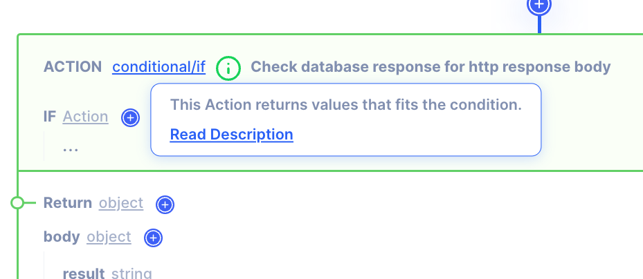

# Description

A description is in-product help that supports and guides users in understanding features, functionalities, and workflows through contextual information and tooltips. It is designed to provide relevant information about features in a timely manner to reduce any possible frustrations frustration.

## Short description

A short description about each feature can be found by hovering over the feature name.  To read the full description, press the **Read Description** button which will open up a full description pace in the right side panel

&gt; Note: The short description modal appear after a second of hover to minimize unwanted modals appearing while moving the mouse around the page.
&gt; 

## Full Description

The right panel full description provides more detailed explanation about the feature.  It also provides examples to follow.

