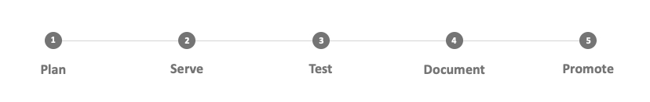

import GuideSteps from "@site/static/img/Guide/guide_steps.jpg";

# Guide

<!-- 

    

 -->

## 1. Plan the API (API)

API specifications, such as OpenAPI, to serve as a blueprint for your API design. It is preferable to consider various use cases ahead of time and ensure that the API adheres to current API development standards.

## 2. Serve the API (Server)

API designers using boilerplate code to prototype APIs. Developers can customize the prototype to internal specifications after it has been tested.

## 3. Test the API

API testing is similar to software testing in that it is required to prevent bugs and defects. API testing tools can be used to test the API's resistance to cyber-attacks.

## 4. Documenting the API

APIs are self-explanatory, but API documentation serves as a guide to improve usability. In a service-oriented architecture, well-documented APIs with a wide range of functions and use cases are more common.

## 5. Market the API

API marketplaces exist in the same way that Amazon is an online retail marketplace for developers to buy and sell other APIs. You can monetize your API by listing it.
