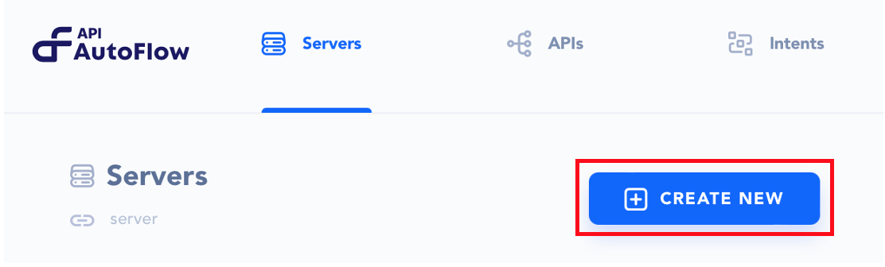
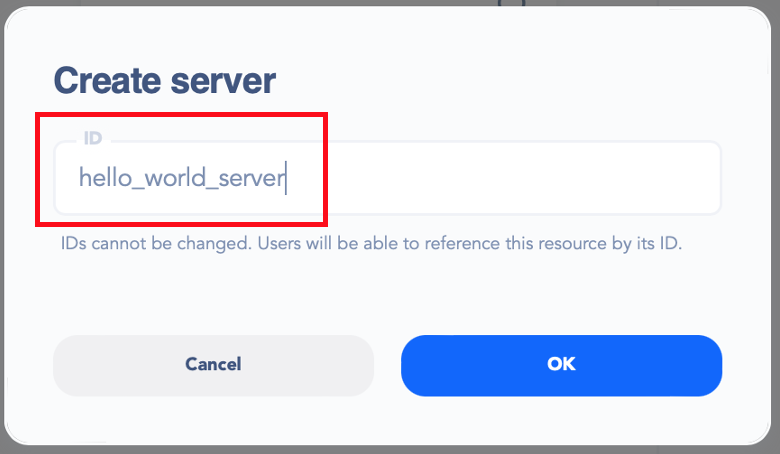
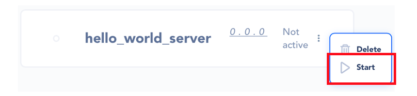
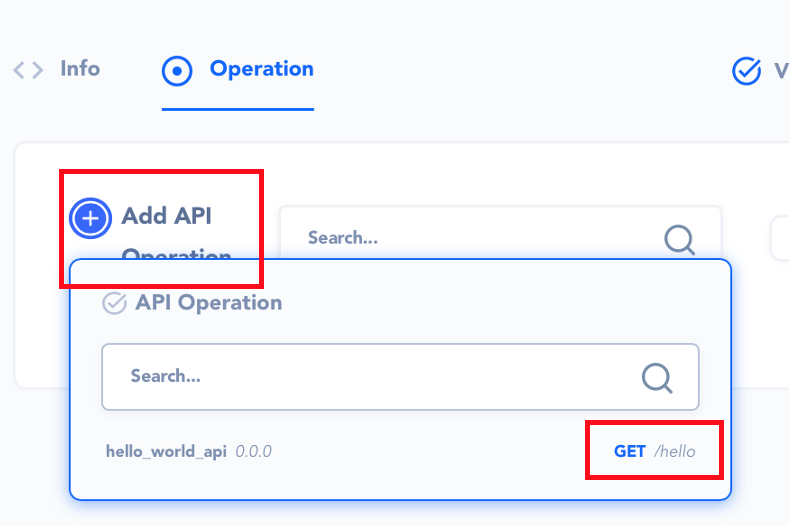
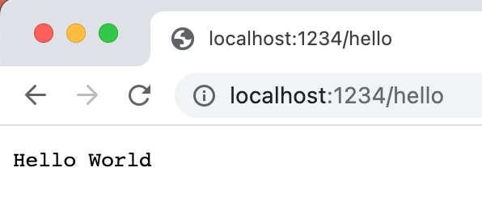

# 2. Serve the API

## What is a **Server**

A server accepts and handles the request and response.

> **A Server is configured to host the paths defined in the API.**

For example, HTTP(S) server is configured with a port number and TLS for secured connections. A server hosts multiple operations and performs the actions to generate the desired outcome.

## Configuring a Server

* Create a new Server

* Create an ID for the server.

* Start the server

### **Define the Server Info**

- Title: Name the server
- Description: Description of the server
- Port: Port number (note that the port number gets applied in real-time)
- Linked API: Link the API that was created in the API Section

### Add API operations

Now that you have lined the server with the API, you can start creating the operations for each of the paths.

### Add an action(s)

Refer to the [Action section](../../actions-library) on how to use Actions

<aside>
💡 Note that the OUTPUT of the action is stored in a **variable** called *output*
</aside>

### Map data to HTTP response body

For us to test on the web browser, let’s put the string/join action’s output in the HTTP response body.

Select **Reference / Data** from the data elements

Change the **variables** reference

## How to call a server

In order to call a server, it is necessary to know the port number assigned to that server. If the server hosting the API is running on the local computer, the domain name would be localhost. The port number used to access the resource on the server would be the one that was assigned to the server during its configuration.

For instance, in our “Hello World” example, we assigned the port number 1234 to our server. This means that we can access the server using the following address: 

Continued reading on this topic includes: 

Enable Log (Server)

Server Operations:
- Simulate
- Delete
- Enable Log
- Enable Capture

Exceptions

Server Security
