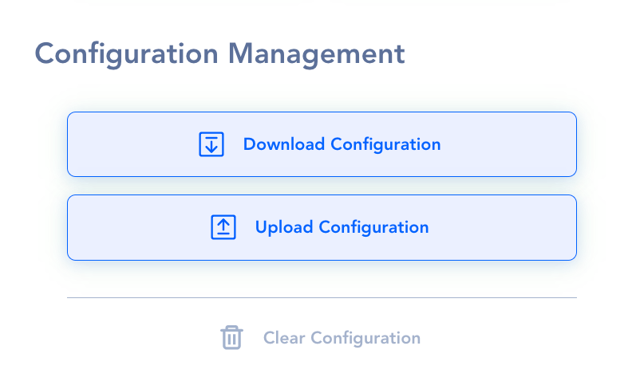

# Settings

## **Configuration Management**

Press the Download button to save the configuration on your computer. The default file name is config.json.

### **Upload Configuration**

Press the **Upload** button to save the configuration on your computer.

## System Environment

### Assign **Name to API AutoFlow**

the API AutoFlow for running multiple instances

### Change **Port** number

for the API AutoFlow is by default `4000`.  You can change the port but need to restart API AutoFlow to take effect.

## Users

### Separate workspace

- Each user has a separate workspace
- Each workspace is secured from other users
- Users can not assign a port number that is already in use by another user

### Administrator

- Can add and delete users

### Member

- Can NOT add or delete users

## License

### Enter the license number.

### Change License Server Address

If installed behind a firewall and a proxy need to be used

## Dark Mode

Turn the Dark Theme on and off

## Feedback Info

Interactor support team may ask you to download the usage info.

