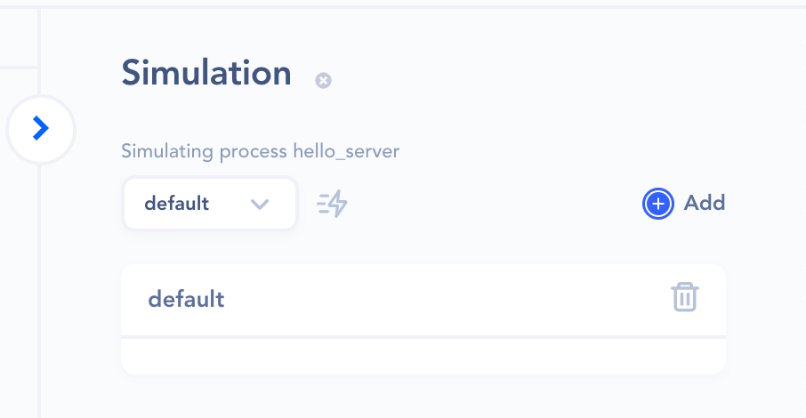
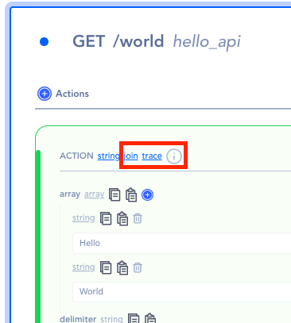

# Data Simulation

Data simulation is a mock HTTP request data simulated for the purpose of testing a server, service during development.  By simulating the data, developers can visualize the expected response as the actions are applied.

There are 

## From Operations

The data can be simulated from both server and service operations

### Simulation button

The simulation button appears when the three dots at the end of the operation is clicked.

### Simulation section

Once simulated, a simulation section will appear on the right pane.

- Use the thunder icon to run the simulations
- Use the Add button to create more simulations when multiple mock data are required for testing

### Color indication

Notice that when the test goes through successfully, the actions and response will turn green.

However, when any part of the operation fails, it will indicate in red.

### Trace

The trace shows the data at a certain state as it passes through the chain of actions.

### Action’s Data

When the trace button is clicked, the trace result appears on the right-bottom pane.

### Result

The resulting data of the action.

### Data

the data that the action has received.