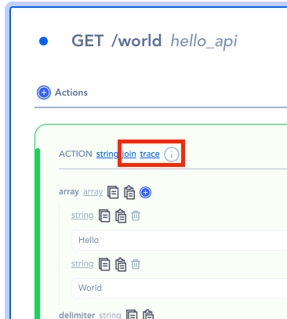

# Simulation Remote

Simulation happens as part of the selected.  However, there are times when you need to execute simulation from another section of the product.

That’s when you would use the Simulation Remote.

Data simulation

### Simulation button

The simulation button appears when the three dots at the end of the operation is clicked.

### Simulation section

Once simulated, a simulation section will appear on the right pane.

- Use the thunder icon to run the simulations
- Use the Add button to create more simulations when multiple mock data are required for testing

### Color indication

Notice that when the test goes through successfully, the actions and response will turn green.

However, when any part of the operation fails, it will indicate in red.

### Trace

The trace shows the data at a certain state as it passes through the chain of actions.

### Action’s Data

When the trace button is clicked, the trace result appears on the right-bottom pane.

### Result

The resulting data of the action.

### Data

the data that the action has received.