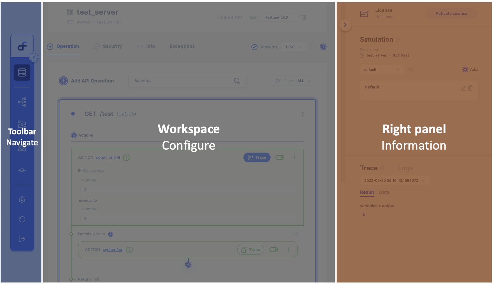

# Layout

API Autoflow is divided into three sections. From left to right, the **toolbar** is used to navigate between sections.  The center **workspace** is where the configuration is one.  The **right panel** is where you can find useful information that helps with your configuration 

## Toolbar

The toolbar is used to navigate between different sections of API AutoFlow.  The toolbar can be expanded to see the name of each section.

- Server
- API
- Service
- Client
- Intent
- Template (roadmap)
- Setting
- History
- Logout

## Workspace

The workspace is where most of the configuration takes place.  

List of selected section’s items, details, and configuration

For example, Server section will display

- List of servers
    - Server Information
    - Exceptions
    - List of server security
    - List of Operations
        - Workflow

## Right Panel

The right panel is where you will find helpful information during the configuration such as logs, traced data, and more.  Right panel is divided into upper and lower panes. 

- License
- Upper pane
    - Simulation Remote
    - Tutorial
    - Description and Help
    - JSON Schema
- Lower pane
    - Logs
    - Trace