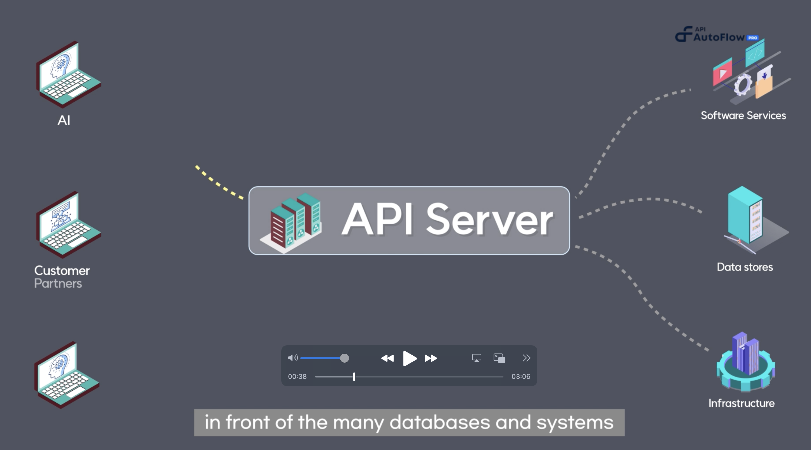

import TutorialOverview from '@site/static/img/tutorial-what-is-apiautoflow.jpg';

# Overview

Welcome to API AutoFlow!

Whether you’re building APIs for databases, web service, or network infrastructure, API AutoFlow helps you create and integrate APIs that matter to you.  You decide what your APIs have to do by building the perfect data and automation [services](../https://www.notion.so/Service-936e49b6f28d41558944966f4d3f8474) for your needs.

Unlike traditional no-code platforms that are made for creating mobile apps and websites, API AutoFlow gives you the power to create and host your own super-flexible application backend for all your API needs.

## Video Tutorial

    

        

            
        

    

    

        

            <h2><code>101</code> Overview</h2>
            
Topics covered

                <ul>
                    <li>Basic concept</li>
                    <li>Use Cases</li>
                    <li>Benefits for Engineers</li>
                    <li>Benefits for Business</li>
                </ul>
            
Duration:  3 mins

        

    

    

## What is API AutoFlow?

&gt; At a high level, API AutoFlow is a configurable API Server.
&gt; 
- API AutoFlow is commonly used in application development to enable developers to build applications that can interact with external services, databases, or other software components. It provides workflow with large library of actions and protocols for how client applications can request and access data or services from the server.
- API AutoFlow allows you to create and expose a set of endpoints or URLs that client applications can send requests to. These endpoints are defined by the API server and represent specific functionalities or resources that can be accessed and defined by drag-and-drop workflows. The server receives the requests, processes them, and returns the appropriate responses back to the client.
- API AutoFlow supports various protocols such as HTTP, MQTT, TCP, and more. It incorporates authentication and authorization mechanisms to control access to the exposed resources and ensure secure communication between the client and server.
- By providing a standardized interface for accessing and manipulating data or services, API servers enable developers to create applications that can leverage the data and functionalities of other systems or components without needing to understand the underlying implementation details. This promotes interoperability, scalability, and modular development in software systems.

### **API AutoFlow simplifies the overall API development**

### Drag-and-drop no-code user interface

API AutoFlow is designed to make API development easier for both expert developers and citizen developers alike. What used to take months for a seasoned Java or Python developer to build, API AutoFlow provides many of the necessary features already built-in.

The user experience is designed to be minimal and simple. For example, an HTTP server can be created by simply providing a port number, which is sufficient for a citizen developer. Advanced features such as TLS and CORS are also available for expert developers to customize based on specific project requirements.

### API Server vs. Gateway vs. Management

An API server is different from an API gateway or API management in that its primary use is to create a new set of APIs for systems and data to achieve better interoperability. On the other hand, an API gateway is more like a traffic light, and API management tools are used to organize and control APIs.

## How it helps the engineers

1. Reduced maintenance
Don’t have to worry about constant database and system changes and updates
2. Accelerate application development
Using a consistent interface, you don’t have to worry about the underlaying data complexity
3. Project Success
Better visibility, collaboration, and higher usage of your APIs

## How it helps the business

1. Faster time-to-market
Developers can have MVPs ready in days and product in matter of weeks
2. Cost saving
Large savings in development and on-going maintenance costs
3. High Return-on-investment (ROI)
Enhanced data access and interoperability empowers developers to do more with less effort
In many projects, ROI is realized in &lt; 6 months

## Use Cases

### 1. Dealing with constant changes with the backend

**Pain Point**

Changes in backend data or services, even as small as adding a field in the database, can force all the applications to update.

**Solution: API Abstraction Layer**

API AutoFlow decouples the applications from the system layer and allows the applications and systems to change and update without affecting each other.

### 2. Need to expand and add new applications

**Pain Point**

Adding new application takes too much time and cost.  It’s like building every new every time.  There must be a way to abstract common features and standardize data access so minimal work is required.

**Solution: API standardization**

API AutoFlow simplifies the application logic and dependency changes, while exposing functionalities as microservices in a secure and controlled manner.