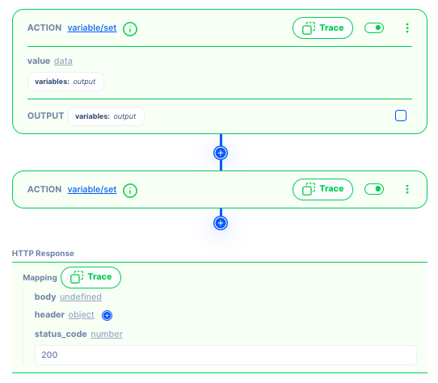

# Trace

A trace is a detailed record of the execution a certain stage of the workflow. It captures the available `data` and their corresponding output `result` or values as it runs. Tracing is often used as a debugging and diagnostic technique to understand and analyze the behavior of a workflow during runtime.

Traces are particularly useful when diagnosing complex issues, understanding the data at each point of the workflow, and identifying logic errors or unexpected behavior. By examining the trace output, developers can gain insights into the workflow's runtime behavior, locate bugs, and make informed decisions on how to fix or improve the code.

### Executing the trace

The simulation needs to be turned in order to use the trace.  That is because the trace uses the simulated data as the starting point.

Tracing can be done by clicking the Trace button at specific points in the workflow to automatically capture and display the execution flow and variable values as the program runs.

### How to view the data

1. Data: Tracing captures the values of relevant variables at a point in the workflow. This can be helpful in understanding how the values change during execution and identifying potential issues or unexpected behavior.
    
    Data that’s received
    
    
    
2. Result: Captures the output or return value including error conditions.
    
    Data after execution
    
    
    

&gt; **Error messages**: If an error or exception occurs during execution, the trace can provide information about the error message, stack trace, and relevant contextual details to aid in debugging and troubleshooting.
&gt;