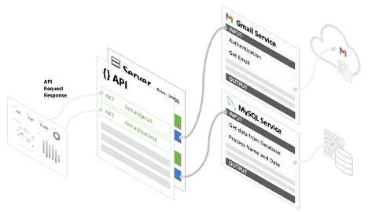

# Service

## What is a Service?

- A service helps the server by taking out commonly used actions into a reusable group.
- A service performs set of operations and its’ [action](../https://www.notion.so/Actions-1645af0f140945e89931d7a261a30437)s.
- A service has an INPUT and an OUTPUT similar to functions in a programming language.

For example, a service to get email from a GMAIL API can be reused by many servers, where the service has multiple actions to accomplish the get email task.



## Configuring a Service

### Create a new Service


Create an ID for the Service.


### Add a new operation


### Define the input and output

&lt;aside&gt;
💡 Behind the scene, [JSON Schema](../https://json-schema.org/understanding-json-schema/) used to perform the input and output validation

&lt;/aside&gt;


Create Input and Output arguments


&lt;aside&gt;
💡 Arguments are the keys for the [JSON Schema](../https://json-schema.org/understanding-json-schema/) properties
For example, for the below JSON, username and password are the arguments

```json
    "username": { "type": "string" },
    "password": { "type": "string" },
```

&lt;/aside&gt;

### Add Actions

Refer to Actions section on how to use Actions

### Map the Action’s output with the Service operation output


&lt;aside&gt;
💡 The data stored in the scope **variable** path *output* is being mapped to the service’s output parameter **name_filtered**

&lt;/aside&gt;

## How to use a Service

### Add Service / Operation action


### Choose a Service Operation


### Select the Service operations


### Set the data to insert into the service INPUT


## Versioning the Service

You can version the Service for easier rollback and management.

### Add new version

Press the Add Version to create a new version


Click on the trash icon to delete the version.

## Service Data Simulation

Refer to the [Data Simulation](../../Workflow/Data%20Simulation) section for how to use the simulation feature.

