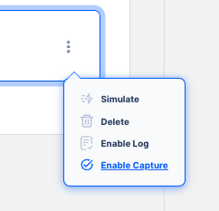

# Capture

API AutoFlow provides a convenient way to capture the incoming data to the server endpoints and service operations.

Typically, a developer would insert code to print logs to capture, view, and check the data being received by each operation. For example, when the frontend developer makes a request to one of the server endpoints (operation), the backend developer captures the data to assess the format and associated fields to work with.

API AutoFlow's simulation feature allows developers to capture data and use it throughout the workflow. This makes it easy to add actions that achieve the operation's functions.

## Capturing the incoming data

The capture feature can be turn on/off from the server and service operation. 

### Capturing from the Server Operation

Press the kebab button on the right of the server operation.

### Capturing from the Service Operation

Press the kebab button on the right of the service operation.

## Accessing the data

### Complete List

A complete list of all captured data can be found in the Settings section.

### Capture All Operations

By turning on the toggle button, all the operations in both the server and service will be captured.

**WARNING!**  Capturing all the data can be extremely compute intensive.

### Operation Specific

In the roadmap, feature to access the data directly from the individual operations