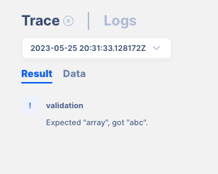

# Debugging

API AutoFlow has a robust debugging features that help the developer quickly identify, analyze, and resolve issues or bugs in the configuration. Debugging involves investigating and fixing errors, unexpected behaviors, or malfunctions that occur during the execution of the configuration.

The primary goal of debugging is to isolate and understand the root cause of a problem so that it can be resolved effectively. 

Below are some strategies that you can take:

- **Reproducing the Issue**: The first step in debugging is to reproduce the issue or bug consistently. This might involve running the configuration under specific conditions, providing specific input using the simulation features, or following a series of steps that trigger the problem. Reproducing the issue helps in identifying the scope and severity of the bug.
Reproducing the issue is also important when getting help.  Unless the issue can be reproduces, it is difficult to know what to fix.
- **Observing and Analyzing Variables**: Once the issue has been reproduced, use the *trace* feature to examine the data throughout the workflow.  While debugging, developers can inspect the values of variables at specific points in the workflow using *trace* to understand their state and identify any unexpected behavior. This helps in detecting incorrect assignments, null or undefined values, or other inconsistencies that may be causing the bug.
- **Analyzing Error Messages and Logs**: Error indication, messages and logs often provide valuable information about the cause of the issue. Analyzing these messages can give insights into the location, type, and context of the error, assisting in narrowing down the problematic area of code.
    - Log the Server, Service, and the Action to narrow down on the problem
    - Trace each step of the workflow to see where the issue may lay
    - Capture the data to the Server or Service to see whether you are working (simulating) with the correct set of data

**Error indication**

**Trace Error Message**

- **Examining the Configuration**: Debugging involves carefully examining the configuration related to the issue. This can include reviewing each action and tracing that directly produces the error or exploring related call that the actions make to identify potential causes. For example, the database that’s being called by the action can be the cause of the issue.  Analyzing the configuration helps in understanding how it is functioning and identifying logical or setting errors, incorrect assumptions, or missing edge cases.
- **Setting Breakpoints**: Debuggers provide the ability to set breakpoints using the `scope/break` or `system/log` action, which are specific locations in the configuration where execution pauses. By setting breakpoints strategically, developers can analyze the state of the workflow at that point, inspect variables, and step through the configuration action by action to understand its flow and identify the issue.
- **Stepping Through the configuration**: With breakpoints in place, developers can step through the action to observe its execution. Stepping through can be done in different ways, such as stepping over actions (*tracing* them without further inspection), stepping into the action calls (going deeper into the dependencies and workflow hierarchy), or stepping out of functions (testing from the external API testing tool).
- **Fixing the Issue**: Once the root cause of the bug is identified, developers can proceed with fixing it. This may involve making changes to the configuration, reordering some actions, or addressing any other necessary adjustments to resolve the issue.  Whatever you do, be sure to *version* you changes for easier rollback.
- **Retesting and Verification**: After applying the fix, it is important to retest the new configuration to ensure that the bug has been resolved and that the change did not introduce any new issues. Testing and verification help in confirming the effectiveness of the fix and ensuring the stability and functionality of the software.  Refer to *CI/CD* for more information