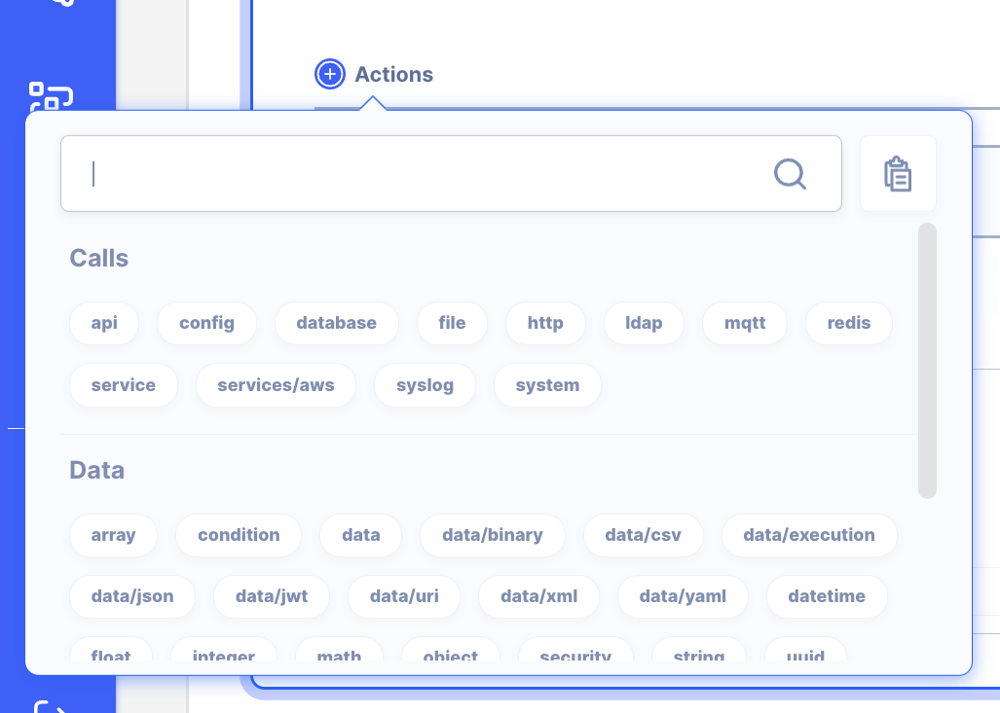

# Action

Actions are the basic building blocks of a workflow, with a few hundred available to choose from. These actions are grouped into three similar features.

**Flow**: Actions that creates the flow such as IF condition, LOOP iteration, and more

**Data**:  Everything you need to work with the data. 

**Calls**: Actions used to make internal and external calls such as making a call to database using the database client

For full list of actions, refer to the Actions Library

[Actions Library](../../Actions%20Library) 

Actions as the name implies are the actions you want to take.  For example, actions that perform  database/operation ,    string/trim  ,   condition/if   and  iteration/filter .  API AutoFlow provides a few hundred action(s) to build the operations and automation as simple as you want or as complex as you need.  You simply daisy chain the actions to create the outcome you need. 

Details about each action are located in the [Actions](../https://www.notion.so/Actions-1645af0f140945e89931d7a261a30437) section of the manual.

**[External Actions](../notion://www.notion.so/Main-Concept-c4e952b2621349408d60b75788032f48#_5i8sqo4myy06)**

These are the actions for connecting with external systems such as databases, APIs, files, and various protocols such as TCP, UDP, and SMTP.

**[Internal Actions](../notion://www.notion.so/Main-Concept-c4e952b2621349408d60b75788032f48#_lvuf1pkf0n5t)**

There are hundreds of actions from conditions, iteration loop, as well as data handling actions for working with string, array, and objects.

Refer to the [reference](../notion://www.notion.so/Main-Concept-c4e952b2621349408d60b75788032f48#_3o3iigbmx7kq) below for full list and description of the actions.