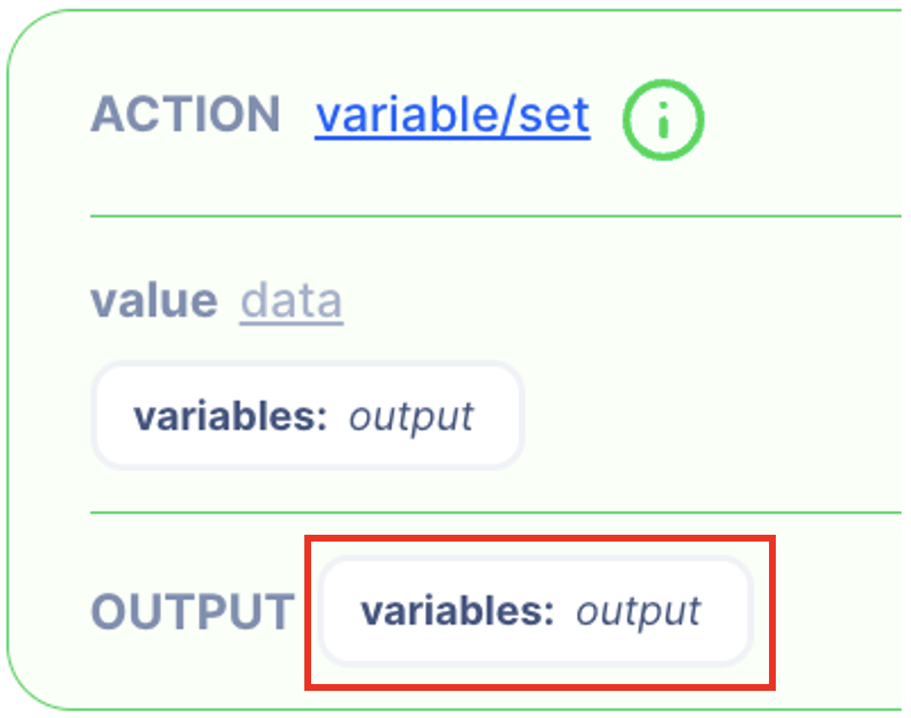

# Scopes and Variables

There are three levels of scope that the data can be stored and accessed.

1. **Global** scope
    1. Available through the product
    2. Configured using Environment Variable in the Settings section
2. **Operation** scope
    1. Available only within the selected operation
    2. Configured using Data Reference in the workflow
3. **Actions** scope
    1. Available only within the selected action
    2. Configured using the *scope* input field in the action

## Operation level scope

Data that is only available within the selected operation. 

### Variables Scope

**Variables** is an operations-level scope that allows users to store data throughout the workflow. However, you can create your own scope by using the manual input function of the Data Reference.

### Inserting the data in the operation level scope

1. Data can be inserted using the **Output**.

1. Selecting reference data

&gt; Note 
- The left side shows the data from generated from the simulation
- The right side is the absolute path to the data.
&gt; 

In the example below, since there’s no data from the simulation, no data is shown 

If you want to create a new scope, you can change the scope name.

### Accessing the data

Use the Reference Data from the Value Type Selector to access the data.

1. Select reference data from Value Type Selector

1. Select the data to access

&gt; Note 
The left side shows the data from generated from the simulation
The right side is the absolute path to the data.
&gt; 

You can either select data from the simulated data on the left side or manually enter an absolute path on the right side.

1. Check the data is correctly referenced

