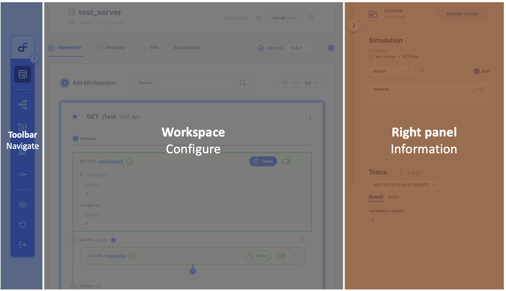
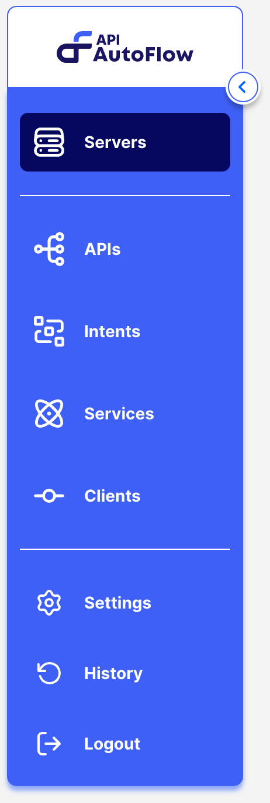

import TutorialHelloWorld from '@site/static/img/tutorial-what-is-apiautoflow.jpg';

# Layout

# Learn with Video Tutorial

    

        

            
        

    

    

        

            <a href="../../../../docs/Tutorial/#103-product-layout-and-navigation"><h2><code>103</code> Layout and Navigation</h2></a>
            
Topics covered

                <ul>
                    <li>Define API</li>
                    <li>Create a Server</li>
                </ul>
            
Duration:  3 mins

        

    

    

## Layout
API Autoflow is divided into three sections. From left to right, the **toolbar** is used to navigate between sections.  The center **workspace** is where the configuration is one.  The **right panel** is where you can find useful information that helps with your configuration 

    

## Toolbar

The toolbar is used to navigate between different sections of API AutoFlow.  The toolbar can be expanded to see the name of each section.

## Workspace

The workspace is where the [workflow](@site/docs/Documentation/Guide/Workflow/Index.md) is configuration.  

## Right Panel

The right panel is where you will find helpful information during the configuration such as logs, traced data, and more.  Right panel is divided into upper and lower panes. 

